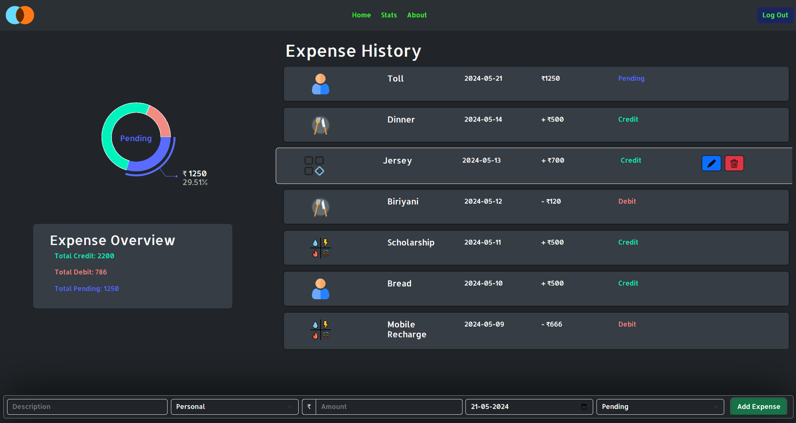
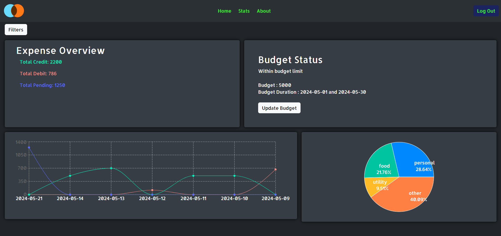
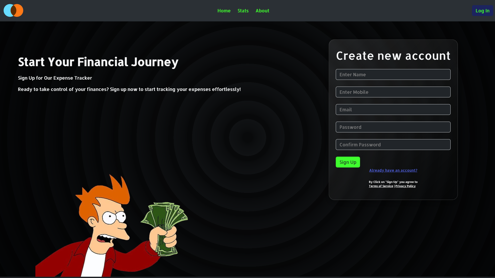

<h1 align="center">
  <br>
  <a href=""></a>
  <br>
  Expense Tracker
  <br>
</h1>

<h4 align="center">Start your financial journey</h4>


<div align="center">
    <a href = "https://en.wikipedia.org/wiki/HTML">
        
    </a>
    <a href = "https://en.wikipedia.org/wiki/MongoDB">
        
    </a>
    <a href = "https://en.wikipedia.org/wiki/React_(software)">
        
    </a>
    <a href = "https://en.wikipedia.org/wiki/Node.js">
        
    </a>
    <a href = "https://en.wikipedia.org/wiki/Express.js">
        
    </a>
    <a href = "https://en.wikipedia.org/wiki/CSS">
        
    </a>
    <a href = "https://en.wikipedia.org/wiki/Npm">
        
    </a>
    <a href = "https://en.wikipedia.org/wiki/Bootstrap_(front-end_framework)">
        
    </a>
</div>

<p align="center">
  <a href="#introduction">Introduction</a> •
  <a href="#homepage">Homepage</a> •
  <a href="#statistics">Statistics</a> •
  <a href="#sign-in/sign-up">Sign in/Sign Up</a> •
  <a href="#how-to-use">How to Use</a> •
  <a href="#contributors">Contributors</a>
</p>


## Introduction
<p>
Welcome to the Expense Tracker, a simple yet powerful tool designed to help you manage your finances with ease. Developed with a focus on user-friendliness and efficiency, this application allows you to keep track of your expenses, categorize them, and analyze your spending habits. Whether you are budgeting for personal use or need a detailed overview of your expenditures for business purposes, the Expense Tracker provides the functionality you need to stay on top of your financial goals.
<p>


## Homepage


<h3>List down your expenses with the form present in the dock</h3>

<p>
  - Enter your expenses with the given form.<br>
  - The expense history section on hover support deletion as well as updation of expenses.<br>
  - Expenses are sorted in descending date format.<br>
  - Also a interactive Pie Chart is provided to display expense distribution as per types(Debit/Credit/Pending)<br>
  - Bottom of the page contains a form which allows user to add expenses.
</p>


## Statistics


<h3>Filtered List of Expenses</h3>
<p>
  - List of filtered expenses is presented as per user's requirement.<br>
  - The stats page shows the history of expenses through a graph for better visual representation.<br>
  - The expenses are also categorised into respective category to provide summary of the transaction.<br>
  - At the bottom the transaction history is also present to show the list of expenses with the applied filters.
</p>

<h3>Budget Section</h3>
<p>
  - A budget section is present at the top right section of the page.<br>
  - After user successfully adds a budget, the expenses are started to track.<br>
  - The difference in budget and debit amount are monitored and displayed to the user.<br>
  - If the user exceeds the set budget limit, a mail is sent to their gmail account.<br>
  - Budget also supports updation and deletion.
  <b><i>User can set budget duration along with the budget amount.</i></b>
</p>

## Sign in/Sign Up




<p>
- Uses React Hooks to implement state changes, which toggles Login/Log out message in the navbar.<br>
- Allows new users to join and authenticates existing user.
<p>

## How to Use

<p>
  - To download the project. Git clone the project in your desktop.
  - Open any folder and type "cmd" in the address bar to open terminal. In the terminal enter
</p>

```npm
git clone https://github.com/no1Gangster/Expense-Tracker.git
```

<p>
  - After Downloading. Install dependencies using

  ```npm
cd Backend
npm i

cd ../Frontend
npm i

```
</p>

<p>
 - Instead use this script to automatically install and launch complete project.

  ```npm
git clone https://github.com/no1Gangster/Expense-Tracker.git
cd Backend
npm install
npm run server

cd ../Frontend
npm install
npm run dev
```
</p>
  
## Contributors


>GitHub [@no1Gangster](https://github.com/no1Gangster) &nbsp;&middot;&nbsp;Frontend<br>
>GitHub [@ADYASHA-2003](https://github.com/ADYASHA-2003) &nbsp;&middot;&nbsp;Backend<br>
>GitHub [@ansuman23](https://github.com/ansuman23) &nbsp;&middot;&nbsp;Backend<br>

